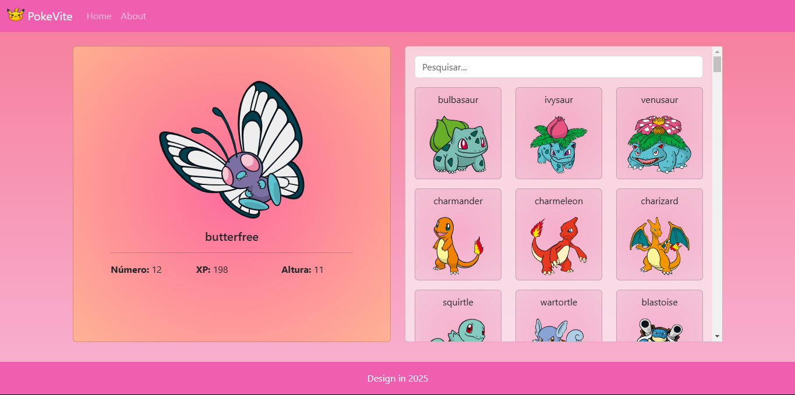

# PokeVite

> [👉 Visite o site do PokeVite 👈](https://pokevite-vue.netlify.app/)

<br>

Prévia do PokeVite

## Objetivo

O PokeVite é um projeto desenvolvido para fins didáticos durante o curso de **Vue.js 3**, ministrado pelo professor **Yuri Marcon**. Ele tem o intuito de praticar o desenvolvimento com **Vue 3**, utilizando **Vite** e consumindo a **API PokeAPI**.

## Descrição

O PokeVite é uma aplicação que permite aos usuários pesquisar e visualizar informações sobre Pokémons de forma interativa e dinâmica. A interface é construída com Vue.js e proporciona uma experiência fluida e responsiva. Além disso, o projeto é uma **Progressive Web App (PWA)**, permitindo que os usuários instalem a aplicação em seus dispositivos e a utilizem offline.


## Tecnologias Utilizadas

Para o desenvolvimento do PokeVite, foram utilizadas as seguintes tecnologias:

- **Vue.js 3**: Framework JavaScript para construção de interfaces de usuário.
- **Vite**: Ferramenta de construção que oferece um ambiente de desenvolvimento rápido.
- **PokeAPI**: API pública que fornece dados sobre Pokémons.
- **Bootstrap**: Framework CSS para desenvolvimento responsivo.
- **HTML**: Linguagem de marcação para estruturar a aplicação.
- **CSS**: Linguagem de estilo para estilização da aplicação.

## Principais Funcionalidades

- Consumo da API PokeAPI para obter informações sobre os Pokémons.
- Exibição de uma lista de Pokémons.
- Detalhes de cada Pokémon, como nome, tipo, habilidades, etc.
- Responsividade para diferentes tamanhos de tela.
- Funcionalidade offline como uma PWA.

## Instalação

Para rodar o projeto localmente, siga os passos abaixo:

1. Clone o repositório:
   ```bash
   git clone https://github.com/soouzaana/PokeVite.git
   ```

2. Navegue até o diretório do projeto:
   ```bash
   cd PokeVite
   ```

3. Instale as dependências:
   ```bash
   npm install
   ```

4. Inicie o servidor de desenvolvimento:
   ```bash
   npm run dev
   ```

5. Abra o navegador e acesse `http://localhost:5173`.